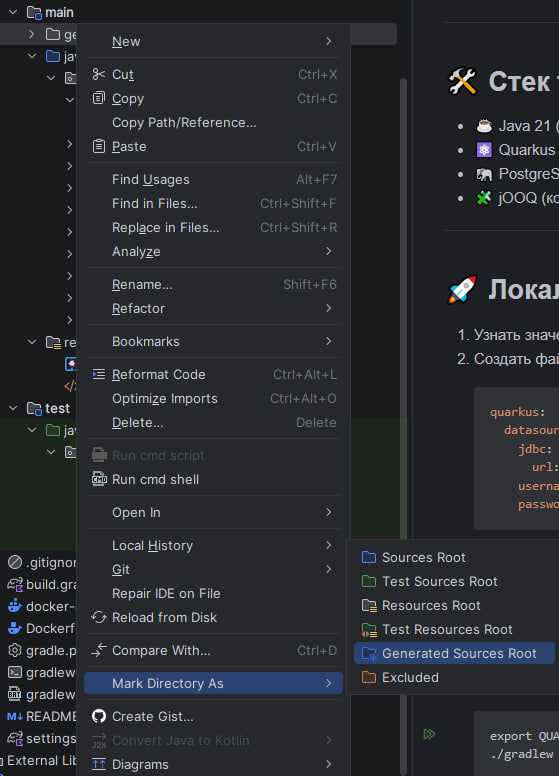

# 🚀 Analytics trainer

> Сервис для прохождения аналитических заданий и отслеживания прогресса пользователей

---

## 📌 Описание

Сервис представляет собой backend-приложение для платформы-тренажёра, в котором пользователи проходят аналитические 
задания, получают оценку результатов, баллы и отслеживают свой учебный прогресс

---

## 📘 Документация по процессам
- ### [Endpoints](docs/endpoints/index.md)
- ### [Git flow](docs/git-flow.md)
- ### [Принципы разработки](docs/principles-of-development.md)

---

## 🛠️ Стек технологий
- ☕ Java 21 (язык разработки)
- ⚛️ Quarkus 3 (framework для разработки REST сервисов)
- 🐘 PostgreSQL (база данных)
- 🧩 jOOQ (конструктор SQL запросов)

---

## 🚀 Локальный запуск
1. Узнать значения `url`, `username` и `password` для подключения к БД
2. Сгенерировать `secret`, сделать это можно [здесь](https://jwtsecretkeygenerator.com/)
3. Создать файл `application.yaml` в папке `config` в корне проекта (если такой папки нет, то создать) с содержимым ниже
   ```yaml
   quarkus:
     datasource:
       jdbc:
         url: <url>
       username: <username>
       password: <password>
   app:
     jwt:
       secret: <secret>
   ```
4. Пометить папку с генерированными jOOQ классами как `generated sources root`

   

5. Выполнить команду, если у вас консоль `shell`
   ```shell
   $env:QUARKUS_CONFIG_LOCATIONS="./config/application.yaml"
   .\gradlew.bat quarkusDev
   ```
   Или, если у вас консоль `bash`, выполнить команду
   ```bash
   export QUARKUS_CONFIG_LOCATIONS=./config/application.yaml
   ./gradlew quarkusDev
   ```

---

## 🔗 Полезные ссылки

| Ссылка                                        | Примечание                                                          |
|-----------------------------------------------|---------------------------------------------------------------------|
| [swagger](http://localhost:8080/q/swagger-ui) | Открывать только после локального<br> старта приложения (порт 8080) |
