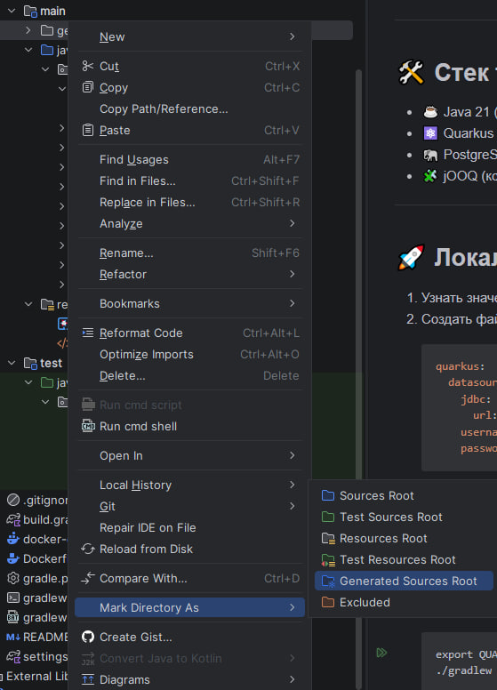

# 🚀 Analytics trainer

## 🧠 О проекте

**Analytics Trainer** — это платформа для развития аналитических навыков на практике.  
Пользователи решают интерактивные задания (тесты, поиск ошибок, открытые вопросы), получают баллы и следят за своим прогрессом.

Проект состоит из:
- **Backend** на Java (Quarkus) — REST API, бизнес-логика, работа с БД.
- **Frontend** на React — пользовательский интерфейс с личным кабинетом, статистикой и тренажёрами.
- **PostgreSQL** — база данных для хранения пользователей, заданий и попыток.

---

## 🌐 Окружения

| Ссылка                                                           | Примечание                                              |
|------------------------------------------------------------------|---------------------------------------------------------|
| [Swagger UI (продакшен)](http://141.8.198.205:8080/q/swagger-ui) | Интерактивная документация API для текущей версии       |
| [Production сайт](https://тренажер-аналитики.рф)                 | Основной веб-интерфейс платформы тренажер-аналитики.рф  |

---

## ✨ Основные возможности

- 🎮 **Интерактивные тренажёры** — задания с автоматической проверкой.
- 📊 **Прогресс и статистика** — график роста баллов, история попыток.
- 👤 **Личный кабинет** — управление профилем, смена пароля.
- 🔐 **Роли пользователей** — `USER` (решает задания) и `ADMIN` (управляет контентом).

---

## 📘 Документация по процессам
- [Endpoints](docs/endpoints/index.md)
- [База данных](docs/database.md)
- [Git flow](docs/git-flow.md)
- [Принципы разработки](docs/principles-of-development.md)

---

## 🛠️ Стек технологий

**Backend:**
- ☕ Java 21 (язык разработки)
- ⚛️ Quarkus 3 (framework для разработки REST сервисов)
- 🐘 PostgreSQL (база данных)
- 🧩 jOOQ (конструктор SQL запросов)

**Frontend:**
- ⚛️ React + TypeScript
- ⚡ Vite (сборщик)
- 🎨 Ant Design (UI-библиотека)
- 🔄 React Router, Axios, TanStack Query

**Инфраструктура:**
- 🐳 Docker, Docker Hub
- 🤖 GitHub Actions (CI/CD)
- 🌍 Ubuntu, Nginx, SSL

---

## 🏗️ Архитектура и деплой

### 🧱 Структура проекта

```
Analytics-trainer/
├── .github/workflows/
│   └── ci-cd.yml
├── config/
│   └── application.yaml               # внешняя конфигурация (секреты)
├── docs/                              # документация по проекту
├── frontend/                          # React-фронтенд
├── gradle/wrapper/
│   ├── gradle-wrapper.jar
│   └── gradle-wrapper.properties
├── src/main/
│   ├── generated/                     # сгенерированные jOOQ-классы
│   │   └── com/example/jooq/generated/
│   │       ├── enums/
│   │       └── tables/
│   ├── java/com/example/
│   │   ├── admin/                     # административные эндпоинты
│   │   ├── attempts/                  # работа с попытками
│   │   ├── auth/                      # регистрация, логин, JWT
│   │   ├── exception_mapper/          # обработка ошибок
│   │   ├── progress_and_profile/      # профиль и прогресс
│   │   ├── ratings_and_achievements/  # рейтинги
│   │   ├── repositories/              # jOOQ-репозитории
│   │   ├── security/                  # фильтры, контекст пользователя
│   │   ├── tasks/                     # получение заданий
│   │   ├── trainers/                  # тренажёры
│   │   ├── utils/                     # утилиты (JWT, Email)
│   │   └── yaml/                      # загрузка конфигурации
│   └── resources/
│       ├── application.yaml
│       └── logback.xml
├── .gitignore
├── build.gradle.kts
├── docker-compose.yml
├── Dockerfile
├── gradle.properties
├── gradlew
├── gradlew.bat
├── README.md
└── settings.gradle.kts
```

- **CI/CD:** GitHub Actions (см. `.github/workflows/ci-cd.yml`)
- **Контейнеризация:** Docker, Docker Hub
- **Сервер:** Ubuntu, Nginx, SSL
- **Деплой происходит автоматически** при пуше в ветку `develop` и `main`:
  - Собирается и тестируется бэкенд
  - Собирается фронтенд (`npm run build`)
  - Публикуется Docker-образ
  - Статические файлы копируются на сервер
  - Контейнер бэкенда перезапускается с новой версией


---

## 🚀 Локальный запуск
1. Узнать значения `url`, `username` и `password` для подключения к БД
2. Сгенерировать `secret`, сделать это можно [здесь](https://jwtsecretkeygenerator.com/)
3. Создать файл `application.yaml` в папке `config` в корне проекта (если такой папки нет, то создать) с содержимым ниже
   ```yaml
   quarkus:
     datasource:
       jdbc:
         url: <url>
       username: <username>
       password: <password>
   app:
     jwt:
       secret: <secret>
   ```
4. Пометить папку с генерированными jOOQ классами как `generated sources root`

   

5. Выполнить команду, если у вас консоль `shell`
   ```shell
   $env:QUARKUS_CONFIG_LOCATIONS="./config/application.yaml"
   .\gradlew.bat quarkusDev
   ```
   Или, если у вас консоль `bash`, выполнить команду
   ```bash
   export QUARKUS_CONFIG_LOCATIONS=./config/application.yaml
   ./gradlew quarkusDev
   ```

---

## 🖥️ Локальный запуск фронтенда

   ```bash
   cd frontend
   npm install
   npm run dev
   ```

   После запуска фронтенд будет доступен по адресу http://localhost:5173.
   Все запросы к API проксируются на бэкенд (настройки в vite.config.ts), поэтому дополнительных действий не требуется.
