# 🛠️ Git flow

---

## 1. Создание feature-ветки

Перейдите в меню `git` в верхней панели `intellij idea`

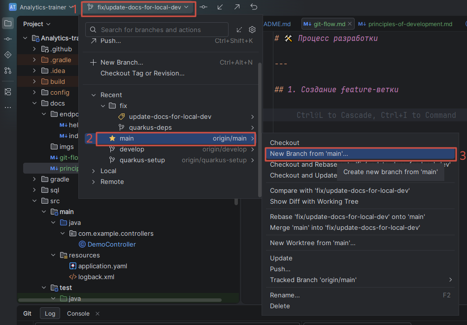

Назовите ветку согласно задаче. Например, если вы реализуете эндпоинт, который называется `/get-info`, то ветка так и 
будет называться `get-info`. И нажмите `create`

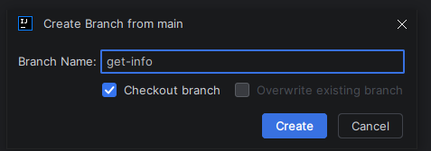

---

## 2. Реализация нового функционала

Реализуйте новый функционал сервиса согласно [принципам разработки](principles-of-development.md) и запушите изменения в
`GitHub`

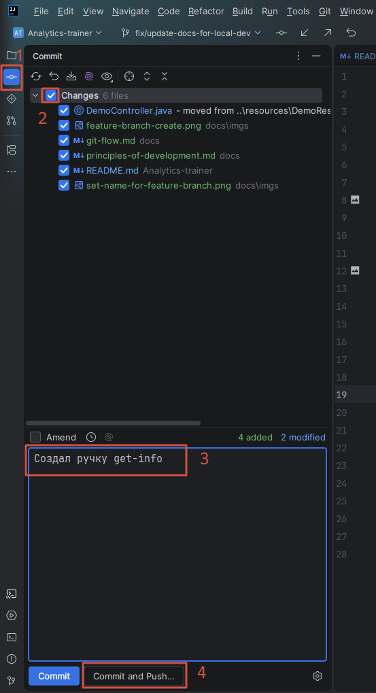

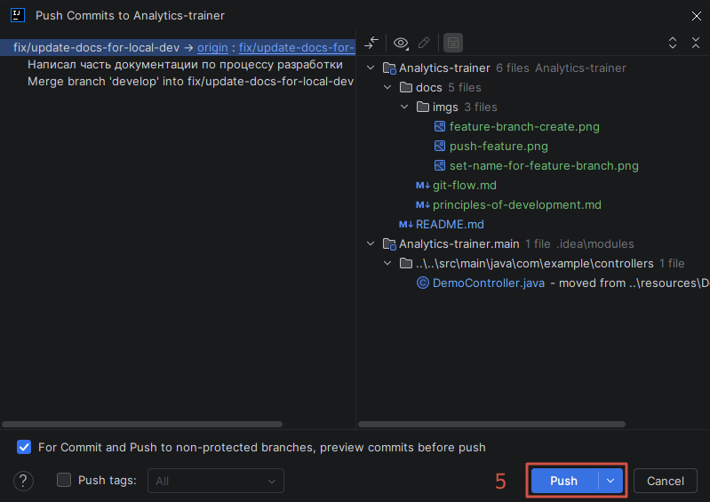

> Перед пушем обязательно проверьте, что все unit-тесты отрабатывают корректно и нет конфликтов с веткой `main`

Чтобы запустить юнит тесты, достаточно выполнить команду
```shell
../gradlew -p .. test
```

Чтобы подтянуть актуальную версию `main` ветки в свою, нужно сделать `fetch`, `update` для `main` ветки и влить `main` в
feature-ветку

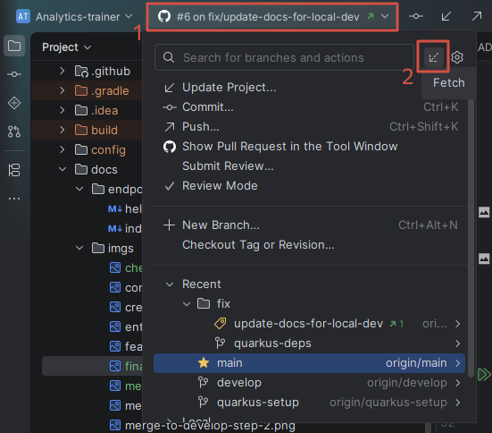

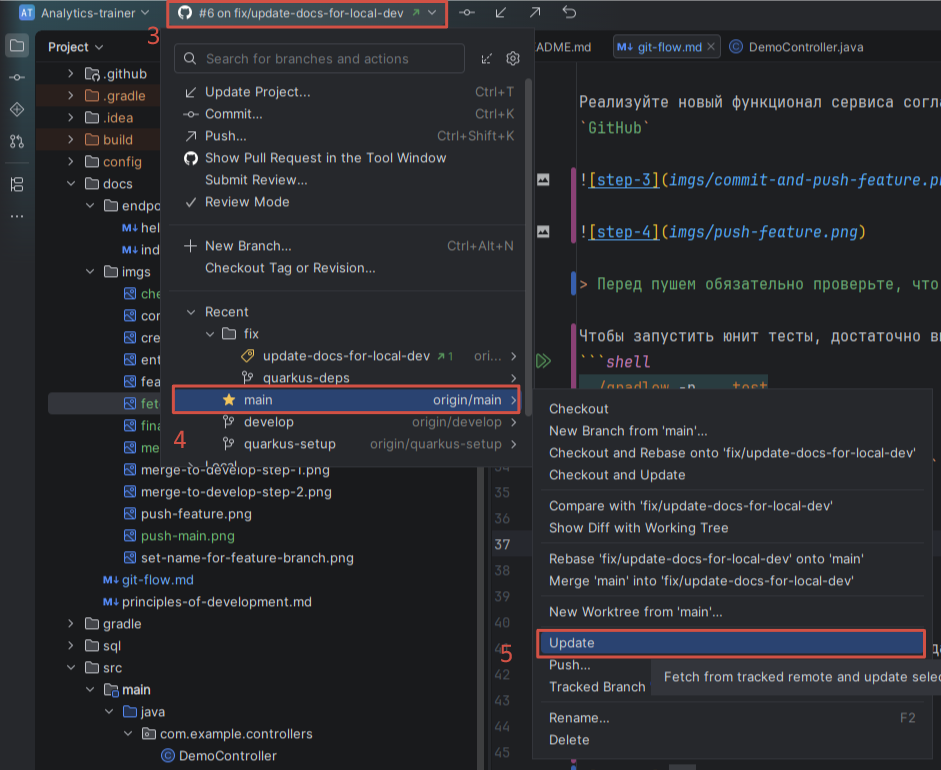

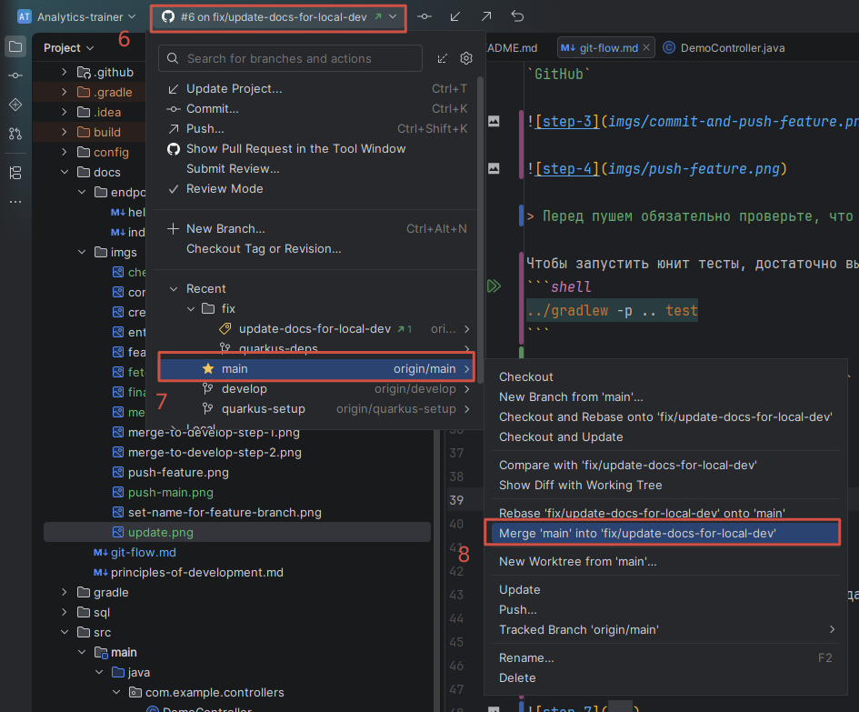

## 3. Создание пул реквеста

Перейдите в [GitHub проекта](https://github.com/RyabininaTV/Analytics-trainer) и создайте пул реквест, указав в целевую
ветку как `develop`

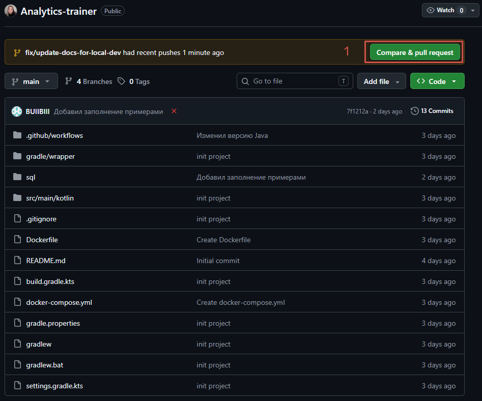

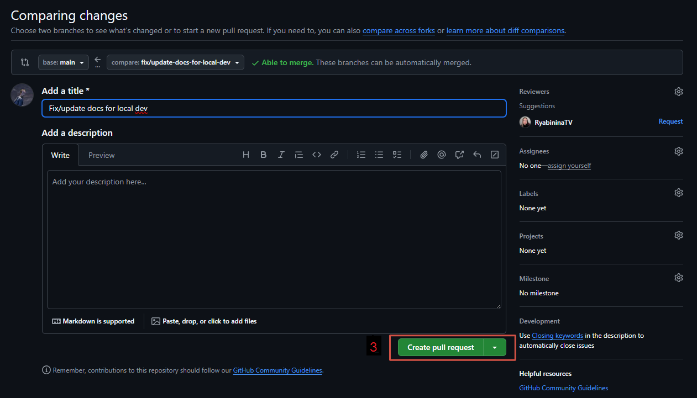

---

## 4. Код ревью

- После того как создастся пул реквест, напишите коллеге в чате, который проревьюит ваш код на корректность и 
  соответствие [принципам разработки](principles-of-development.md)
- Коллега проревьюит ваше решение и пришлет треды (кейсы, которые стоит исправить в вашем коде)
- Исправьте необходимые треды, и запушите изменения в `GitHub` аналогично пункту 2
- Напишите в ответ к каждому треду **`поправил(а)`**, или если тред решили не исправлять, то обоснованно укажите
  причину
- Если все треды закрыты и ревьюер оставил **`Ок`**, значит ревью пройдено и можно деплоить!

---

## 5. Деплой фичи

Чтобы задеплоить свою фичу, нужно перейти на страницу своего пул реквеста и смержить свою ветку в `develop`

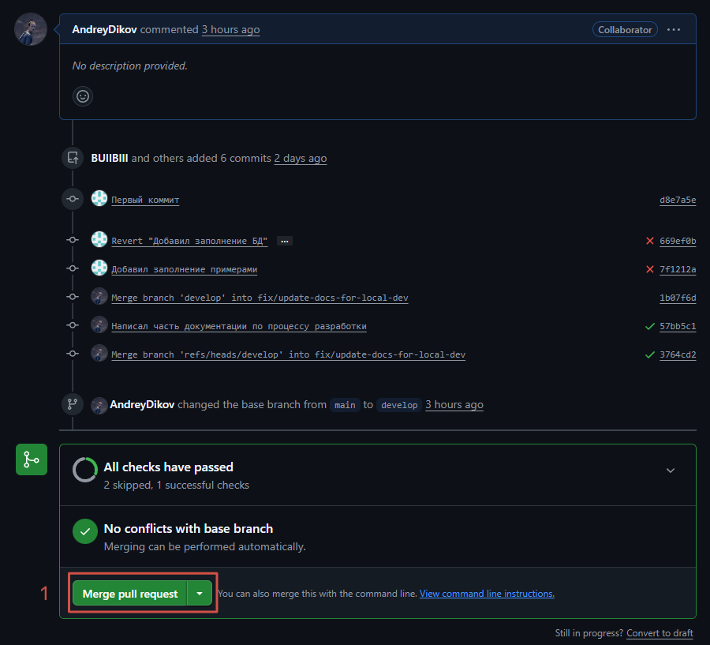

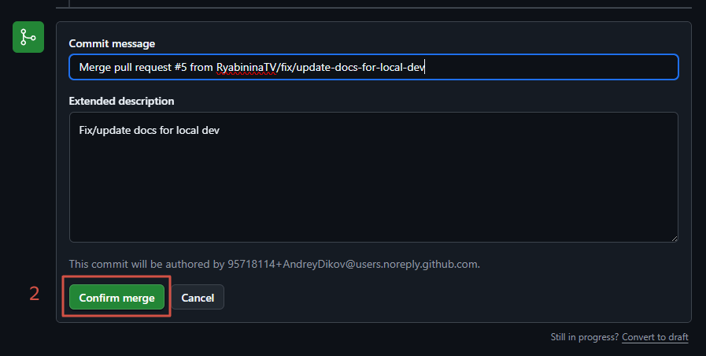

После мержа запустится пайплайн
1. `build-and-test` -- сборка проекта и запуск тестов
2. `docker-build` -- сборка докер образа
3. `deploy` -- деплой на сервер

Когда все шаги пайплайна отработают успешно, ваша фича будет доставлена на продовый сервер

---

## 6. Мерж в `main` ветку

В конце разработки нужно смержить ветку `develop` в `main` ветку

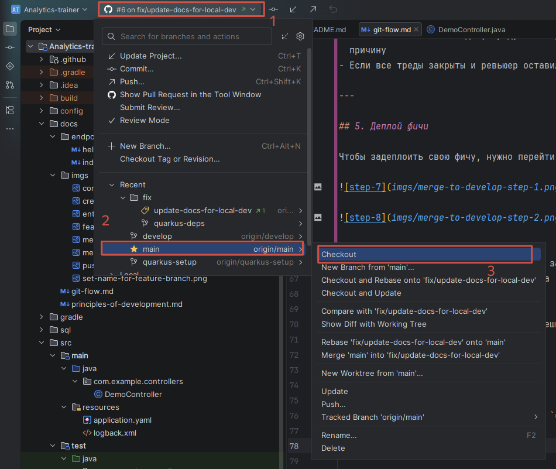

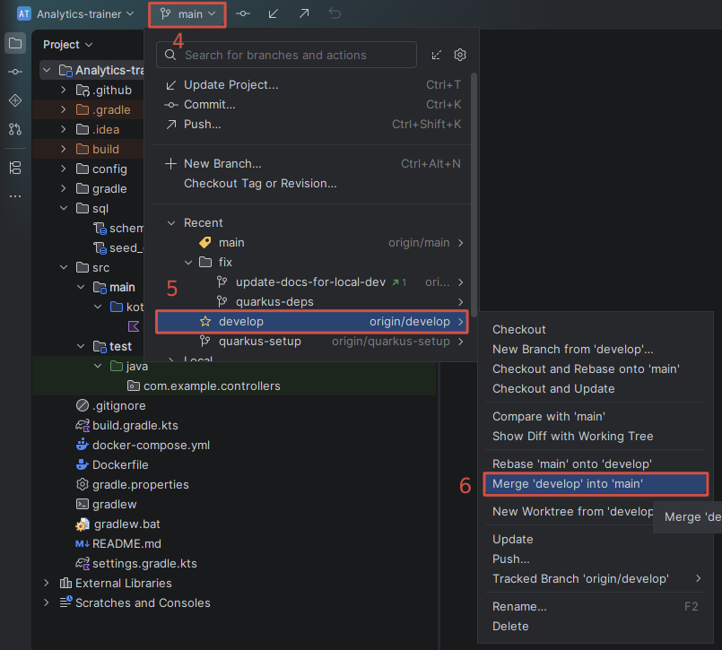

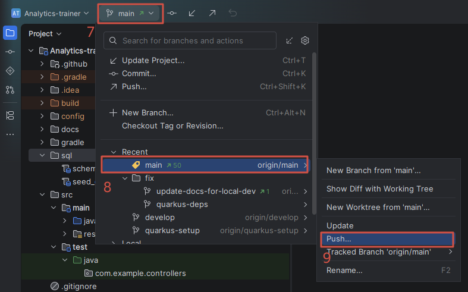

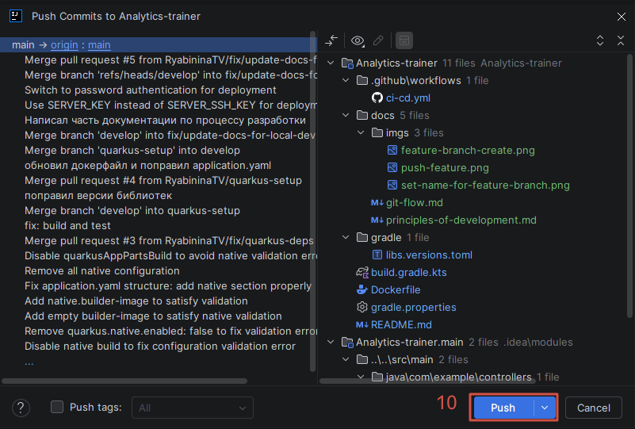
